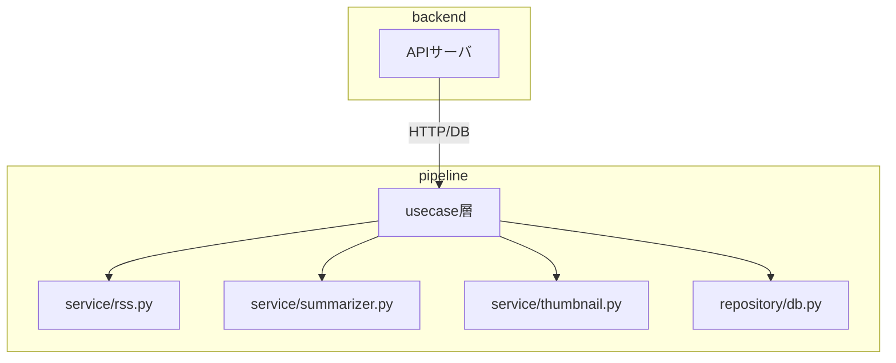
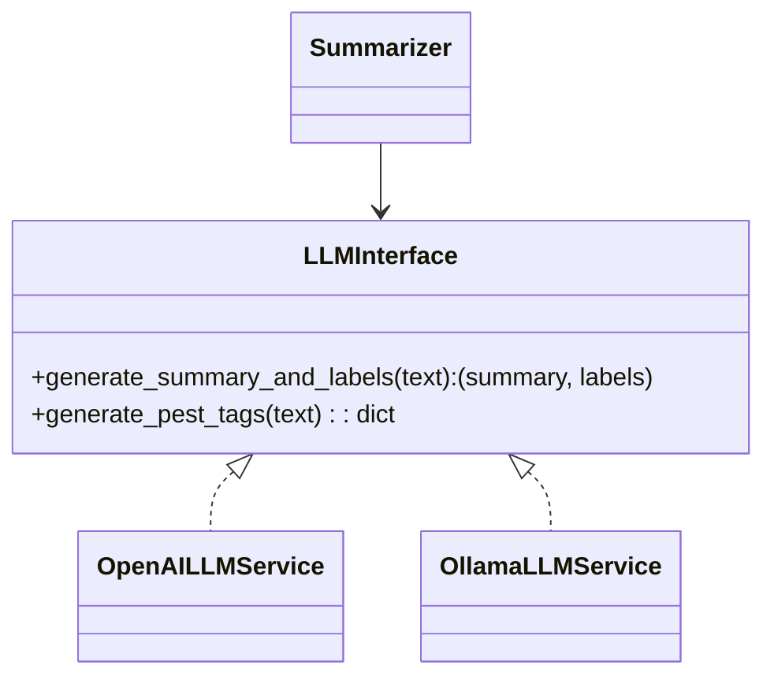
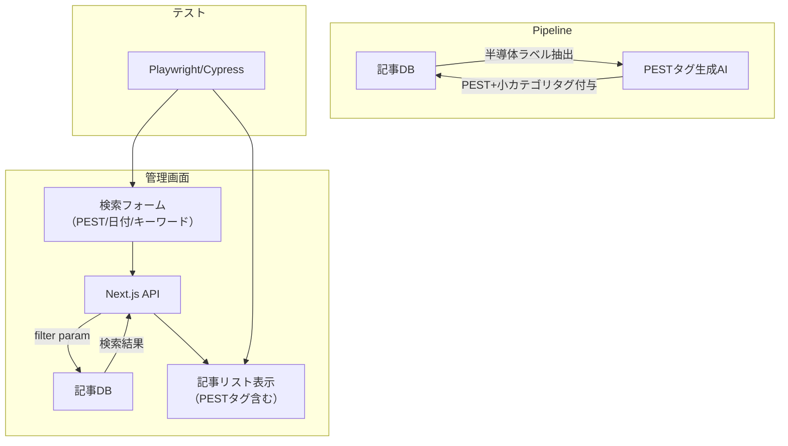

# semicon_topics プロジェクト README

## 目次

- [プロジェクト設計ドキュメント（AIパイプライン構成）](#プロジェクト設計ドキュメントaiパイプライン構成)
  - [ディレクトリ構成（推奨案）](#ディレクトリ構成推奨案)
  - [設計方針](#設計方針)
  - [backendとの役割分担](#backendとの役割分担)
  - [拡張性・保守性](#拡張性保守性)
  - [関係性イメージ](#関係性イメージ)
- [マイルストーン1：Hello World（Next.js + Express）](#マイルストーン1helloworldnextjsexpress)
  - [構成](#構成)
  - [受け入れ基準](#受け入れ基準)
  - [テスト要件](#テスト要件)
- [マイルストーン2：DB連携](#マイルストーン2db連携)
  - [構成](#構成-1)
  - [受け入れ基準・テスト要件](#受け入れ基準テスト要件)
  - [セットアップ手順](#セットアップ手順)
- [マイルストーン3：RSS自動収集](#マイルストーン3rss自動収集)
  - [サービス構成・全体像](#サービス構成全体像)
  - [RSS取得対象](#rss取得対象)
  - [受け入れ基準](#受け入れ基準-1)
  - [テスト要件](#テスト要件-1)
- [マイルストーン5：半導体特化タグ & 管理画面絞込](#マイルストーン5半導体特化タグ--管理画面絞込)
  - [実装イメージ](#実装イメージmermaid)
- [アーキテクチャ構成](#アーキテクチャ構成)
- [セットアップ・起動手順](#セットアップ起動手順)
- [開発・運用Tips](#開発運用tips)
- [リファクタリング・今後の改善案](#リファクタリング今後の改善案)
- [参考](#参考)
- [トラブルシューティング](#トラブルシューティング)


---

# プロジェクト設計ドキュメント（AIパイプライン構成）

## ディレクトリ構成（推奨案）

```
pipeline/
  service/
    rss.py           # RSS取得・パース
    summarizer.py    # 要約＋タグ付け
    thumbnail.py     # サムネイル取得
    translate.py     # 翻訳（将来追加）
    ...
  repository/
    db.py
    ...
  usecase/
    crawl_articles.py
    summarize_articles.py
    tag_articles.py
    fetch_thumbnails.py
    ...
  rss_feeds.yaml
  main.py
```

## 設計方針

- **service層**  
  機能単位（RSS取得、要約、タグ付け、サムネイル取得、翻訳など）でファイルを並列に増やせる。AI/外部API/スクレイピングなどの追加・拡張が容易。
- **repository層**  
  DBや外部ストレージなど「データアクセス」に特化。
- **usecase層**  
  業務ロジック・バッチ処理を集約し、service/repositoryを組み合わせて実装。
- **pipeline直下**  
  設定ファイル（rss_feeds.yaml）やエントリポイント（main.py）を配置。

メリット
service層は「機能単位」でファイルを並列に増やせるため、AI/外部API/スクレイピングなどの追加・拡張が容易
repository層はDBや外部ストレージなど「データアクセス」に特化
usecase層は「業務ロジック・バッチ処理」を集約し、service/repositoryを組み合わせて実装
backendはAPIサーバや認証、外部サービス連携など「Webアプリの中核」を担い、crawlerのバッチ処理やAI処理はAPI経由で呼び出す
crawlerは「情報収集・AI処理のマイクロサービス」として独立性・拡張性を重視
関係性イメージ（Mermaid）
crawler

backend

HTTP/DB

APIサーバ

usecase層

service/rss.py

service/summarizer.py

service/thumbnail.py

repository/db.py

この構成により、将来的なAI機能や外部連携の追加も容易で、各層の責務が明確になります。

## backendとの役割分担

- **backend**  
  APIサーバや認証、外部サービス連携など「Webアプリの中核」を担う。pipelineのバッチ処理やAI処理はAPI経由で呼び出す。
- **pipeline**  
  情報収集・AI処理のマイクロサービスとして独立性・拡張性を重視。

## 拡張性・保守性

- 新たなAI機能や外部連携もservice層に追加するだけで拡張可能。
- 各層の責務が明確で、テスト・保守・チーム開発にも強い構成。

## 関係性イメージ




---

<a id="milestone1"></a>
## マイルストーン1：Hello World（Next.js + Express）

<a id="milestone1-structure"></a>
### 構成
- **web**: Next.js (App Router)
- **api**: Express (TypeScript, any禁止)
- **docker compose v2**（Go実装、公式推奨）で2サービスを起動

#### ディレクトリツリー例
```
.
├── docker-compose.yml
├── .env
├── web/
│   ├── Dockerfile
│   ├── package.json
│   ├── tsconfig.json
│   ├── next.config.js
│   ├── next-env.d.ts
│   └── app/
│       └── page.tsx
└── api/
    ├── Dockerfile
    ├── package.json
    ├── tsconfig.json
    └── src/
        └── index.ts
```

<a id="milestone1-criteria"></a>
### 受け入れ基準
- `docker compose up` でweb(3000)・api(4000)両方が起動する
- Next.jsのトップページ（`/`）でAPI `/api/hello` のレスポンス"Hello, World!"が表示される
- Express側で `/api/hello` エンドポイントが正しく実装されている
- TypeScriptで`any`型を使わず、型安全が担保されている
- 各サービスのDockerfileでビルド・起動が可能
- **docker-compose v1系ではなく、docker compose v2（スペースあり）コマンドで動作すること**

<a id="milestone1-test"></a>
### テスト要件
- web: `/`でAPIレスポンスが正しく表示されること
- api: `/api/hello`で"Hello, World!"が返ること
- TypeScriptで`any`型を使わないこと（tsconfig, eslint等でチェック）

---

<a id="milestone2"></a>
## マイルストーン2：DB連携

<a id="milestone2-structure"></a>
### 構成
- PostgreSQL（永続化ボリューム付き）
- Express (Node.js, /api/articles)
- Next.js (app/articles/page.tsx)
- Docker Compose

<a id="milestone2-criteria"></a>
### 受け入れ基準・テスト要件
- PostgreSQLに`articles(id, title, url, source, created_at)`テーブルが作成されている
- `/api/articles` GETでDBの全記事がJSON配列で返る
- Next.jsの`/articles`で記事一覧が表示される
- DBデータはコンテナ再起動・再構築でも消えない
- Jest+SupertestでAPIの単体テストが実行できる
- Next.jsコンポーネントテスト雛形が存在する

<a id="milestone2-setup"></a>
### セットアップ手順
1. `docker compose up --build`
2. ブラウザで [http://localhost:3000/articles](http://localhost:3000/articles) にアクセスし記事一覧が表示されること
3. または `curl http://localhost:4000/api/articles` で記事一覧がJSONで返ること

### DB 操作方法
```shell
docker compose exec db psql -U semicon_topics -d semicon_topics

# データ削除
TRUNCATE TABLE articles;
```

---

<a id="milestone3"></a>
## マイルストーン3：RSS自動収集

<a id="milestone3-structure"></a>
### サービス構成・全体像
- **crawler（Python 3.11 + FastAPI）**  
  - 非同期でRSS取得・パース  
  - 期間指定（日付単位、開始日／終了日）  
  - DB（Postgres）へtitle, url, sourceを重複チェックしつつINSERT  
  - HTTP/JSON API（OpenAPI/Swagger UI自動生成）
- **docker-compose.yml**  
  - crawlerサービス新規追加
- **Express API（api/src/index.ts）**  
  - `/api/admin/crawl` POSTエンドポイント追加  
  - 期間パラメータ受け取り、crawler APIを呼び出し
- **Next.js管理画面（frontend/app/admin/page.tsx）**  
  - 日付ピッカー（開始日／終了日）  
  - 「記事収集」ボタン  
  - 実行中／完了ステータス表示（ローディングスピナー or 成功／失敗メッセージ）  
  - UIコンポーネントはMUI, Ant Design, shadcn/ui等を利用

<a id="milestone3-rss"></a>
### RSS取得対象
- https://eetimes.jp/rss/
- https://www.itmedia.co.jp/rss/news.xml
- https://www3.nhk.or.jp/rss/news/cat0.xml
- https://news.mynavi.jp/rss/index.rdf

<a id="milestone3-criteria"></a>
### 受け入れ基準
- crawlerコンテナが上記RSSを取得し、articlesテーブルに重複なく保存できる
- 期間指定（日付単位）が可能で、指定範囲の記事のみ保存される
- /api/admin/crawlエンドポイントが動作し、crawler APIを呼び出して結果を返す
- 管理画面から記事収集がトリガーでき、実行中／完了ステータスが表示される
- デフォルトで1日分の収集が可能
- テスト（単体・統合テスト雛形）が用意されている

<a id="milestone3-test"></a>
### テスト要件
- モックRSSフィードでcrawler単体テストが通る
- 既存記事と重複しないことを確認するテスト
- /api/admin/crawlの統合テスト雛形が存在する
- 管理画面からのトリガーでDBに記事が追加されることを確認できる
- 期間指定の境界値（開始日・終了日）で正しくフィルタされる

<a id="milestone3-image"></a>
### 実装イメージ（Mermaid）
```mermaid
flowchart TD
  subgraph Frontend (Next.js)
    AdminPage["管理画面（/admin）"]
    DatePicker["開始日／終了日ピッカー"]
    Button["記事収集ボタン"]
    Status["実行中／完了ステータス"]
  end
  subgraph API (Express)
    CrawlAPI["/api/admin/crawl"]
  end
  subgraph Crawler (FastAPI)
    RSSFetcher["RSSクローラー"]
  end
  subgraph DB (Postgres)
    ArticlesTable["articlesテーブル"]
  end

  AdminPage --> DatePicker
  AdminPage --> Button
  AdminPage --> Status
  Button -- fetch(POST) --> CrawlAPI
  DatePicker -- fetch(POST) --> CrawlAPI
  CrawlAPI -- HTTP/JSON --> RSSFetcher
  RSSFetcher -- INSERT (重複チェック) --> ArticlesTable
```

<a id="milestone5"></a>
---

## LLM基盤の切替設計（ollama/llama2:7b-q4対応・クリーンアーキテクチャ化）

### 1. ollamaサービスの追加（docker-compose）

- `ollama`サービスをdocker-compose.ymlに追加
  - 例:
    ```yaml
    ollama:
      image: ollama/ollama:latest
      ports:
        - "11434:11434"
      volumes:
        - ollama_data:/root/.ollama
    ```
- `pipeline`サービスから`http://ollama:11434/v1/chat`でAPI呼び出し可能

### 2. LLM呼び出し層のクリーンアーキテクチャ化

- `pipeline/service/llm_interface.py`（抽象クラス/プロトコル）を新設
  - `generate_summary_and_labels`, `generate_pest_tags`等のインターフェースを定義
- 実装クラス例
  - `OpenAILLMService`（OpenAI API用）
  - `OllamaLLMService`（ollama/llama2:7b-q4用, REST APIで呼び出し）
- 依存注入（DI）でどちらのLLMを使うか切替可能に
  - `.env`や設定ファイルで`LLM_PROVIDER=openai|ollama`等を指定
- 既存のsummarizer.py等はこのインターフェース経由でLLMを利用

### 3. LLM切替の運用例

- `.env`例
  ```
  LLM_PROVIDER=ollama
---

## 全体の運用方法・ollamaモデル管理

### 1. サービス起動・停止

```sh
# サービス起動（初回はモデルDLが必要な場合あり）
docker compose up -d

# サービス停止
docker compose down
```

### 2. ollamaモデルの管理・永続化

- ollamaのモデル（例: llama2:7b-q4）は `ollama_data` ボリュームに永続化されるため、通常は再DL不要
- ただし `docker compose down -v` でボリュームを削除すると再DLが必要

#### モデルの初回pull（手動またはMakefile推奨）

```sh
# ollamaサービスを起動
docker compose up -d ollama

# モデルをpull（初回のみ必要）
docker compose exec ollama ollama pull llama2:7b-q4
```

#### Makefile例

```makefile
ollama-pull:
	docker compose up -d ollama
	docker compose exec ollama ollama pull llama2:7b-q4
```

### 3. LLM切替・設定

- `.env` で `LLM_PROVIDER=openai` または `LLM_PROVIDER=ollama` を指定
- ollama利用時は `OLLAMA_BASE_URL` なども設定可能

### 4. 注意点

- ボリュームを消さない限り、モデルは再DL不要
- モデル追加・切替時はpullコマンドを実行
- サービス構成やYAMLのインデントミスに注意

---
  OLLAMA_BASE_URL=http://ollama:11434
  OPENAI_API_KEY=...
  ```
- 将来、他のLLM（Claude, Gemini, Azure等）にも容易に差し替え可能

### 4. 設計イメージ（Mermaid）



---
## マイルストーン5：半導体特化タグ & 管理画面絞込

<a id="milestone5-structure"></a>
### 構成

- **DB**: `articles`テーブルに`pest_tags`（JSONB）カラムを追加
- **パイプライン**: 「半導体」ラベルの記事に対し、OpenAI APIでPEST+小カテゴリタグを自動生成し`pest_tags`へ保存
- **API**: `/api/articles`でpest_tags・日付・キーワード等による絞り込みに対応
- **管理画面**: Next.js（frontend）でPESTタグ・日付・キーワードによる検索UIを実装
- **UIテスト**: Playwright/Cypressで主要な検索パターンの自動テスト雛形を用意

<a id="milestone5-criteria"></a>
### 受け入れ基準

- 「半導体」ラベルの記事にPEST+小カテゴリタグが自動付与されている
- 管理画面でPESTタグ・日付・キーワードで記事を絞り込める
- 検索結果にPESTタグが正しく表示される
- APIでpest_tagsによる絞込ができる
- UIテスト雛形で主要な検索パターンが自動化されている
- TypeScript/DBスキーマでany型・型不明利用がない

<a id="milestone5-test"></a>
### テスト要件

- 「半導体」記事にPESTタグが付与されていることを確認
- 管理画面でPESTタグ（例:「T:EUVリソグラフィ」）を指定し検索→該当記事のみ表示
- 日付範囲・キーワード・PESTタグの複合検索が正しく動作
- 検索結果にPESTタグが正しく表示される
- 存在しないPESTタグで検索→0件になる
- 主要なUI操作（入力・検索・リセット）が自動テストで網羅されている

<a id="milestone5-image"></a>
### 実装イメージ（Mermaid）


---

## アーキテクチャ構成

```
[frontend (Next.js)] --API--> [api (Express/TypeScript)] --DB--> [db (Postgres)]
                                         |
                                         | HTTP/JSON
                                         v
                                [crawler (FastAPI/Python)]
```

- **frontend**: Next.js + MUI。記事収集UI・記事一覧表示。APIルートでapiサービスにプロキシ。
- **api**: Express/TypeScript。DBアクセス・crawlerへのプロキシ。ビジネスロジックは薄く、APIゲートウェイ的役割。
- **crawler**: Python/FastAPI。クリーンアーキテクチャ/オニオンアーキテクチャで層分割。  
  - `entity`: Articleエンティティ
  - `repository`: RSS取得・DB保存
  - `usecase`: 記事収集ユースケース
  - `interface`: FastAPIルーティング
- **backend**: 旧APIサーバ（今後整理予定）
- **db**: Postgres。articlesテーブルに記事を保存

---

## セットアップ・起動手順

1. 必要要件: Docker, Docker Compose
2. プロジェクトルートで
   ```
   docker compose up --build
   ```
3. ブラウザで `http://localhost:3000/crawl` にアクセス
4. 収集対象サイト・期間を選択し「記事収集」ボタンで実行
5. 記事一覧が下部に表示される

---

## 開発・運用Tips

- 依存追加はpackage.json/requirements.txt編集後、`docker compose build`で反映
- DB確認は
  ```
  docker compose exec db psql -U semicon_topics -d semicon_topics
  ```
- ポート競合時はVSCodeの「ポート」タブで転送を切断 or PC再起動

---

## リファクタリング・今後の改善案

- crawlerのusecase層・repository層の型注釈強化、テストコード追加
- backendサービスの役割整理（apiサービスに統合も検討）
- RSSソースのメタデータ管理（DB or 設定ファイル化）
- 記事一覧のページネーション・検索機能追加
- CI/CDパイプラインの整備

---

## 参考

- milestone3_rss_crawler_spec.md … 詳細設計・受け入れ基準
- tech_stack_proposal.md … 技術選定理由


---

<a id="troubleshooting"></a>
## トラブルシューティング

- DB名エラー（database "semicon" does not exist）  
  - docker-compose.ymlのPOSTGRES_USER, POSTGRES_DB, backend/.envのDATABASE_URLをすべて同じ値（例: semicon_topics）に統一してください
  - 古いDBボリュームが残っている場合は `docker compose down -v` で完全削除してから `docker compose up` してください
- nodemon not found, next not found など依存が見つからない場合  
  - Alpine Linuxのnpmバージョンやキャッシュの影響でdevDependenciesがインストールされないことがあります
  - 最も確実な方法は、ローカルで一度 `npm install` を実行し、`package-lock.json` を生成してコミットすることです
  - それでも解決しない場合は、node:20-bullseye等Alpine以外のNode.jsイメージを使うことも検討してください
- permission denied エラー  
  - 権限を付ける
  ```shell
  sudo chown -R $USER:$USER ./backend/db/data
  sudo chown -R 999:999 ./backend/db/data
  ```
- ビルドするたびにdbディレクトリの権限がdnsmasqに奪われる。
  ```shell
  cat /etc/passwd
  ```
  
  権限がついている先はPostgreSQLだった。
  - docker-compose.ymlのdbセクションに以下を追加
  ```yaml
      user: "${UID}:${GID}"
  ```
  これでdocker-compose upのたびに権限が奪われることはなくなる。
