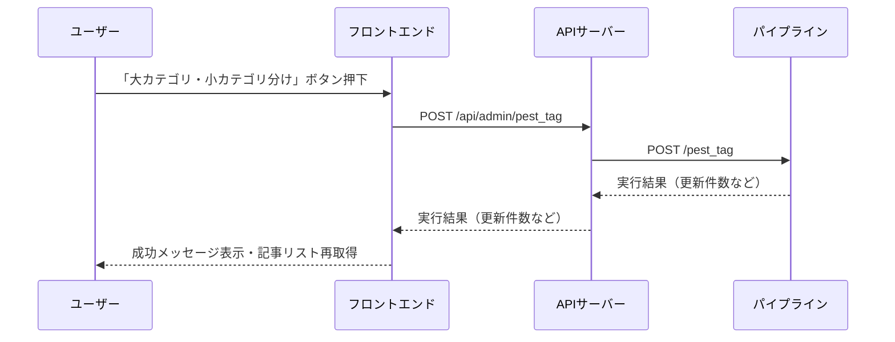

# 「大カテゴリ・小カテゴリ分け」バッチ設計案

## 目的
記事収集画面で「大カテゴリ・小カテゴリ分け」ボタンを押すと、PESTタグ（大カテゴリ・小カテゴリ）を自動付与し、DBに登録する機能を追加する。

---

## 現状のシステム構成

- **フロントエンド**（Next.js/React, MUI）
  - 記事一覧画面で記事の表示・削除は可能
  - 「要約・ラベル付け」バッチボタンは `/summarize` ページや `/crawl` ページに実装済み
- **APIサーバー**（api/src/index.ts, Express）
  - /api/admin/summarize で要約・ラベル付けバッチ
  - /api/admin/pest_tag（未実装）でカテゴリ分けバッチを追加予定
- **パイプライン**（pipeline/interface/api.py, Python/FastAPI）
  - /summarize, /tag, /pest_tag（コメントアウト中）などのバッチAPI
  - categorize_pest_articles.py でPESTタグ付与ロジック

---

## 実現方針

### A. フロントエンド
- 記事収集画面に「大カテゴリ・小カテゴリ分け」ボタンを追加（既存の「要約・ラベル付け」ボタンと同じUI/UX）
- ボタン押下時、`/api/admin/pest_tag` をPOSTで呼び出し
- 実行後、記事リストを再取得して反映

### B. APIサーバー
- `/api/admin/pest_tag` エンドポイントを新設（POST）
- このエンドポイントでパイプラインの `/pest_tag` を呼び出す
- 実行結果（更新件数など）をフロントに返却

### C. パイプライン
- `/pest_tag` エンドポイントを有効化し、`categorize_pest_articles` を呼び出す
- 必要に応じて、limit等のパラメータを受け取る

### D. LLMプロンプト
- `summarize_articles` → `generate_summary_and_labels`（要約・ラベル付け用プロンプト）
- `categorize_pest_articles` → `generate_pest_tags`（カテゴリ分け用プロンプト）

---

## シーケンス図（Mermaid）

---

## 実装タスク一覧

1. **フロントエンド**
    - [ ] 「大カテゴリ・小カテゴリ分け」ボタン追加
    - [ ] ボタン押下時にAPI呼び出し・ローディング制御・結果表示
    - [ ] 実行後に記事リスト再取得

2. **APIサーバー**
    - [ ] `/api/admin/pest_tag` エンドポイント新設（POST）
    - [ ] パイプラインの `/pest_tag` を呼び出し
    - [ ] 実行結果をフロントに返却

3. **パイプライン**
    - [ ] `/pest_tag` エンドポイントの有効化
    - [ ] `categorize_pest_articles` の呼び出し

---

## 備考・確認事項

- バッチ処理の対象は「全記事」
- プロンプトの切り替えは LLMサービス層で実装済み
- 今後の拡張性も考慮し、API設計・プロンプト管理を整理