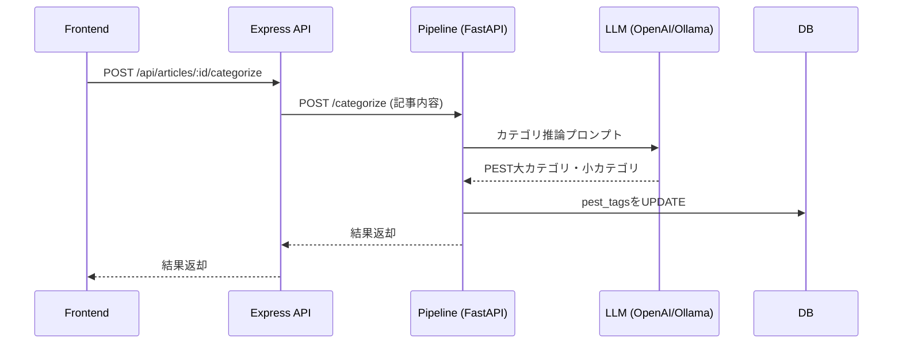

# カテゴリ分け機能リファクタリング・再設計プラン

## 目的
- カテゴリ分けボタン押下時に、大カテゴリ・小カテゴリ（PESTタグ）をDBに登録できるようにする
- admin系ソースは「正しいものに置き換え」、現状の機能（記事収集・要約・PESTタグ自動付与等）は維持し、デグレを防ぐ

---

## カテゴリ仕様（2025/04/28追記）

- **大カテゴリ（PEST）**  
  - 政治（Politics）
  - 経済（Economy）
---

## LLMによる自動カテゴリ付与フロー（2025/04/28追記）

- 「大カテゴリ・小カテゴリ」ボタン押下時、記事内容をLLM（OpenAI/Ollama等）に投げてPEST大カテゴリ・小カテゴリを自動推論・付与する
- フロー例：



- 既存の「要約・ラベル付け」ボタンと同様の仕組みで実装可能
- pipeline側でPESTカテゴリ推論用のプロンプト・LLM呼び出しロジックを実装
- フロントエンドは「大カテゴリ・小カテゴリ」ボタン押下時にAPIを呼び出すだけでOK

---
  - 社会（Society）
  - 技術（Technology）

- **小カテゴリ（例）**  
  - 買収
  - 製造技術
  - 新製品
  - 国の動き
  - 企業の動き
  - 株価

---
---

## 現状整理
- frontendのカテゴリ分けボタンは既存のものをそのまま活用
- DB（Postgres）のarticlesテーブルには`pest_tags`（JSONB）カラムがあり、PEST大カテゴリ・小カテゴリの格納は可能
- pipeline側に自動PESTタグ付与バッチ（categorize_pest_articles.py）は存在
- Express API（api/src/index.ts）にはカテゴリ登録用エンドポイントが未実装
- admin系API（/api/admin/～）が一部残存

---

## 改善・リファクタリング方針

1. **カテゴリ分けボタンUIは現状維持**
   - 新規UI追加は不要
   - 既存ボタンからカテゴリ分けAPIを呼び出す

2. **API新設**
   - `/api/articles/:id/pest_tags`（PATCH/PUT/POST）エンドポイントをExpressに追加
   - リクエスト例:  
     ```
     PATCH /api/articles/123/pest_tags
     { "pest_tags": { "P": ["半導体"], "E": ["EUV"], "S": [], "T": [] } }
     ```

3. **admin系API・UIの整理**
   - 不要なadmin系API・UIは削除
   - 必要な機能（記事収集・要約・PESTタグ自動付与等）は新API/構成で維持
   - デグレが起きないよう、既存機能のテスト・動作確認を徹底

4. **pipelineバッチの整理**
   - categorize_pest_articles.pyは自動付与用途で残す
   - 手動付与はExpress API経由で行う

5. **README・設計ドキュメント更新**
   - 新しいカテゴリ分けフロー・API仕様を追記

---

## 新アーキテクチャ概要

```mermaid
flowchart TD
  FE[frontend (Next.js)]
  API[api (Express/TypeScript)]
  DB[(db (Postgres))]
  FE -- "PATCH /api/articles/:id/pest_tags\n{ pest_tags: {P:[],E:[],S:[],T:[]} }" --> API
  API -- "UPDATE pest_tags" --> DB
  FE -- "GET /api/articles" --> API
  API -- "SELECT * FROM articles" --> DB
```

---

## 実装タスク

1. admin系API・UIの不要部分を削除
2. Express APIにカテゴリ分け用エンドポイントを新設
3. frontendの既存カテゴリ分けボタンから新APIを呼び出すよう修正
4. pipelineバッチは自動付与用途で残す
5. 既存機能のテスト・動作確認（デグレ防止）
6. README・設計ドキュメントの更新

---

## デグレ防止のためのチェックリスト

- 記事収集（RSSクローラー）機能が動作する
- 記事要約・ラベル付与バッチが動作する
- PESTタグ自動付与バッチが動作する
- 記事一覧・詳細画面が正しく表示される
- カテゴリ分けボタンからPESTタグが登録できる

---

## 今後の拡張性
- pipelineの自動PESTタグ付与と、手動付与（今回実装）が両立可能
- pest_tags以外の属性追加も容易