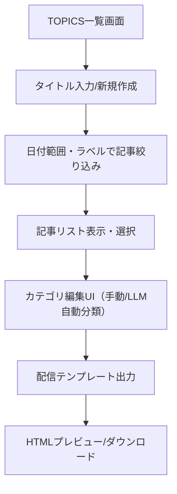

# 半導体TOPICS配信画面 詳細設計

---

## 1. 画面構成（ワイヤーフレーム風）

```
┌──────────────────────────────────────────────┐
│ [TOPICSタイトル入力] [新規TOPICS作成]         │
├──────────────────────────────────────────────┤
│ [日付範囲ピッカー] [ラベル選択（複数可）]     │
│ [記事リスト絞り込み]                          │
│ 記事リスト（表/カード切替, 日付/出典/要約/ラベル） │
│ [ ] チェックボックスで記事選択              │
│ [カテゴリ編集ボタン/タグUI]（記事ごとに手動カテゴリ付与） │
│ ────────────────────────────────────── │
│ [カテゴリ分け（LLM自動分類）]                │
│ ────────────────────────────────────── │
│ [配信テンプレート出力] [プレビュー] [ダウンロード] │
└──────────────────────────────────────────────┘
```

---

## 2. UIコンポーネント詳細

- TOPICSタイトル入力テキストフィールド（例: "2025年5月号 半導体TOPICS" など自由入力）
- 新規TOPICS作成ボタン
- 日付範囲ピッカー（開始日・終了日）
- ラベル選択（複数可、タグ型UI）
- 記事リスト（表/カード切替、日付/出典/要約/ラベル表示、チェックボックス選択）
- **カテゴリ編集UI（記事ごとに大カテゴリ・小カテゴリを手動で付与/編集、クリックで選択・タグ型UIやドロップダウン）**
- **カテゴリ分け（LLM自動分類）ボタン（自動分類と手動編集の両立）**
- 配信テンプレート出力ボタン（プレビュー/ダウンロード）

---

## 3. データフロー・操作例

1. TOPICSタイトルを自由入力 or 新規TOPICS作成
2. 日付範囲・ラベルを指定して記事リストを絞り込み
3. 記事リストから対象記事をチェックボックスで選択
4. 各記事の「カテゴリ編集」UIで大カテゴリ・小カテゴリを手動で付与/編集
5. [カテゴリ分け（LLM自動分類）]ボタンで一括自動分類も可能（手動編集と両立）
6. [配信テンプレート出力]ボタンでHTMLプレビュー/ダウンロード
7. 必要に応じて記事・カテゴリを再編集し、再出力

---

## 4. API連携例

- GET /api/articles?date_from=2025-05-01&date_to=2025-05-31&label=半導体,AI
  - 日付範囲・ラベルで記事を絞り込み取得
- POST /api/topics
  - 新規TOPICS作成（{ title: "2025年5月号 半導体TOPICS", articles: [...] }）
- POST /api/topics/{id}/categorize
  - 選択記事のカテゴリ分け（LLM自動分類）
- PATCH /api/topics/{id}/article/{article_id}/category
  - 記事ごとのカテゴリ手動編集
- POST /api/topics/{id}/export
  - 配信テンプレートHTML出力

---

## 5. 画面遷移・データフロー図（Mermaid）



---

## 6. データ構造例

- TOPICS
  - id: string
  - title: string (例: "2025年5月号 半導体TOPICS" など自由入力)
  - articles: Article[]
  - categories: { 大カテゴリ: string, 小カテゴリ: string[] }
  - template_html: string

- Article
  - id, title, url, source, published, summary, labels, 
  - categories: { main: string, sub: string[] }  # ←カテゴリ分け結果を保持

---

## 7. ユーザー操作例

1. TOPICSタイトルを「2025年5月号 半導体TOPICS」と入力し新規作成
2. 日付範囲「2025-05-01～2025-05-31」、ラベル「半導体,AI」で記事を絞り込み
3. 記事リストから5件選択
4. 各記事の「カテゴリ編集」UIで大カテゴリ・小カテゴリを手動で付与/編集
5. [LLM自動分類]で一括カテゴリ分けも可能
6. [配信テンプレート出力]でHTMLプレビュー
7. [ダウンロード]でHTML保存

---

## 8. 【重要】カテゴリ順での並び・テンプレート出力仕様

- 記事データにはカテゴリ情報（大カテゴリ・小カテゴリ）を必ず保持する
- プレビュー・テンプレート出力時は「大カテゴリ」→「小カテゴリ」→「記事」の順でグループ化・ソートして表示
- 例：  
  - 技術
    - 製造技術
      - 記事A
      - 記事B
    - 新製品
      - 記事C
  - 経済
    - 株価
      - 記事D
- テンプレートHTMLもカテゴリ順で出力されるようにロジックを設計

---
## 9. 実装時の整合性・注意点

- 記事取得API（/api/articles?date_from=...&date_to=...&label=...）が正しく絞り込み・ソートできるか
- 記事選択・カテゴリ編集の状態管理（UIとデータ構造の同期、未選択時の挙動）
- LLM自動分類と手動編集の競合時の優先順位・UIでの明示
- 記事ごとのカテゴリ情報の保存・API連携（PATCH/POSTで正しく反映されるか）
- テンプレート出力時のカテゴリ順グループ化ロジック（フロント/バックどちらで処理するかを明確化）
- 既存TOPICSデータとの互換性（新旧データ構造の差異に注意）
- バリデーション（タイトル未入力、記事未選択、カテゴリ未設定時の警告・ガード）
- APIエラー・通信エラー時のUI表示（ユーザーに分かりやすく通知）
- 他画面（記事一覧・詳細等）とのデータ整合性（カテゴリ情報の反映・表示）

---