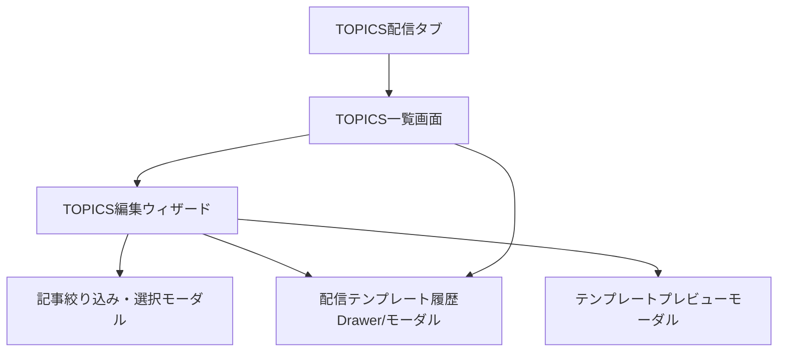

# TOPICS配信タブ UI/UXデザイン刷新案

## 1. UI/UXデザインの基本方針

- **情報の階層化・一貫性**  
  主要な操作（新規作成・編集・出力）は常に同じ位置・同じ操作感で提供。  
  一覧→詳細→編集→出力の流れを「迷わず」「戻りやすく」設計。

- **認知負荷の最小化**  
  1画面1目的。不要な情報は隠し、必要な時だけ表示（プログレッシブ・ディスクロージャー）。  
  記事選択やテンプレ出力などはウィザード/モーダルで段階的に。

- **フィードバックと状態管理**  
  保存・出力・自動生成などの操作は、即時フィードバック（スナックバー/トースト/ローディング/進捗バー）。  
  編集中・未保存・エラー・完了などの状態を明示。

- **アクセシビリティ・レスポンシブ**  
  キーボード操作・スクリーンリーダー対応。  
  PC/タブレット/スマホで最適化（MUIのGrid/Stack/Drawer活用）。

- **感情的価値の付与**  
  成果物（配信テンプレート）出力時に「達成感」や「シェアしたくなる」演出。  
  例：出力完了時にアニメーションや「今月のTOPICSが完成しました！」の祝福UI。

---

## 2. 画面構成・遷移フロー（UX強化版）

---

## 3. 各画面・コンポーネント詳細

### 3-1. TOPICS一覧画面

- **カード＋表のハイブリッドUI**  
  月ごとにカード表示（サムネイル/タイトル/記事数/要約プレビュー/出力履歴バッジ）＋詳細は表で展開
- **主要操作**  
  - 新規作成（FAB/右下固定ボタン）
  - 検索・フィルタ（年月/キーワード/記事数/出力有無）
  - テンプレ履歴Drawer呼び出し
- **UXポイント**  
  - ホバーで編集・出力ボタン表示
  - 進捗バッジ（未編集/編集中/出力済み）

### 3-2. TOPICS編集ウィザード

- **ステップ型ウィザード（例：MUI Stepper）**
  1. タイトル・月入力
  2. 記事絞り込み・選択（モーダル/Drawerで分離、選択中はプレビュー表示）
  3. 月次まとめ自動生成・手動編集（200~500字、進捗バー/文字数カウント）
  4. カテゴリ分け（ドラッグ&ドロップで並べ替え/グルーピング）
  5. 保存・配信テンプレ出力
- **UXポイント**
  - ステップごとに「次へ」「戻る」明示
  - 途中保存・下書き管理
  - 主要操作は画面下部の固定アクションバーに集約

### 3-3. 記事絞り込み・選択モーダル

- **多段フィルタUI**  
  日付範囲・ラベル・キーワード・出典で絞り込み
- **記事リスト**  
  表/カード切替、サムネイル・要約・ラベル・カテゴリ表示
- **選択操作**  
  チェックボックス＋「すべて選択」「選択解除」  
  選択中記事は右側プレビュー/カウント表示

### 3-4. 配信テンプレート履歴Drawer/モーダル

- **履歴リスト**  
  出力日・プレビュー・ダウンロード・再出力ボタン
- **UXポイント**  
  - プレビューはモーダルで即時表示
  - 履歴がない場合は「まだ出力されていません」ガイダンス

### 3-5. テンプレートプレビューモーダル

- **HTMLプレビュー**  
  実際の配信テンプレートをそのまま表示
- **操作**  
  - ダウンロード
  - 閉じる
  - シェア（将来的拡張）

---

## 4. 体験価値を高める演出・工夫

- **進捗・達成感**  
  ステップ完了時にアニメーションや「お疲れさまでした！」のメッセージ
- **エラー/未保存警告**  
  編集中に離脱しようとしたら警告ダイアログ
- **ローディング/非同期操作**  
  主要操作はスケルトン/スピナー/進捗バーで待ち時間を快適に
- **アクセシビリティ**  
  色覚対応・コントラスト・キーボード操作・ARIA属性

---

## 5. 今後の拡張性

- **AIアシスト**  
  記事選択や要約編集時に「AIおすすめ」ボタン
- **コラボレーション**  
  編集履歴・コメント・複数人編集対応
- **通知・シェア**  
  配信完了時にSlack/メール通知、URLシェア

---

## 6. 参考UIコンポーネント（MUI）

- AppBar, Drawer, Stepper, Card, DataGrid, Dialog, Snackbar, Skeleton, Chip, Badge, SpeedDial, Tooltip, ProgressBar, Tabs, Accordion, etc.

---