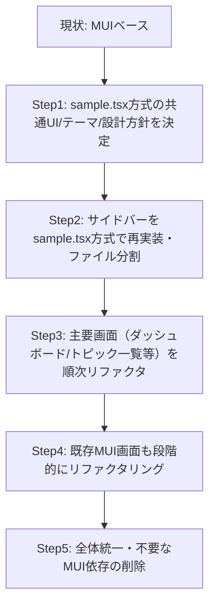

# フロントエンド モダン化リファクタリング計画

## 方針
- **sample.tsxのモダンな構成（shadcn/ui, tailwindcss, atomic design, i18n, next-themes, framer-motion等）をPJ全体の標準とする**
- **既存のMUIベースの画面も段階的にリファクタリングし、UI/UX・設計を統一する**
- **まずはサイドバーから着手し、atomic design的にファイル分割・再利用性を高める**
- **sample.tsxはcanvasプレビュー用だったため、実際の実装ではコンポーネント単位でファイル分割を行う**

---

## リファクタリングロードマップ



### Step1: 設計方針・技術スタックの標準化
- sample.tsxの設計思想・UI/UX・技術スタック（tailwind, shadcn/ui, i18n, atomic design, next-themes等）をPJの標準とする
- デザインガイドライン・コーディングルールを明文化

### Step2: サイドバーの再実装・ファイル分割
- sample.tsxのサイドバー部分を切り出し、`Sidebar.tsx`等のコンポーネントとして分割
- atomic design（atoms, molecules, organisms, templates, pages）を意識した構成に
- サイドバーのUI/UX・アニメーション・i18n・ダーク/ライトモード対応を実装

### Step3: 主要画面のリファクタリング
- ダッシュボード、TOPICS一覧など主要画面からsample.tsx方式で再実装
- 共通UIコンポーネント（Button, Input, Card等）はshadcn/ui/tailwindベースで統一

### Step4: 既存MUI画面の段階的リファクタ
- 既存のMUIベースの画面も順次リファクタリング
- UI/UX・設計の統一、不要なMUI依存の削除

### Step5: 全体統一・最終調整
- UI/UX・設計の全体統一
- コードベースの整理・不要な依存の削除

---

## 補足・留意点
- sample.tsxはcanvasプレビュー用だったため、実装時はatomic designに沿ってファイル分割・責務分離を徹底
- サイドバー以外の画面も順次同様の方針でリファクタリング
- tailwindcss, shadcn/ui, next-themes, framer-motion等の依存がPJ全体で使える状態か要確認
- デザインガイドラインやFigma等の資料があれば参照

---

## 優先度・着手順
1. サイドバー（Sidebar.tsx, NavItemComponent等）の切り出し・再実装
2. ダッシュボード、TOPICS一覧など主要画面のリファクタ
3. 共通UIコンポーネントの整備
4. 既存MUI画面の段階的リファクタ

---

## 参考：atomic design的なファイル分割例

```
frontend/
  components/
    atoms/
      Button.tsx
      Input.tsx
      ...
    molecules/
      NavItem.tsx
      TaskCard.tsx
      ...
    organisms/
      Sidebar.tsx
      AdminPanel.tsx
      ...
    templates/
      DashboardTemplate.tsx
      ...
    pages/
      DashboardPage.tsx
      TopicsPage.tsx
      ...
```

---

## 今後の進め方
- この計画に沿って、まずはサイドバーからsample.tsx方式で再実装・ファイル分割を進める
- 進捗・課題は随時ドキュメント化し、PJ全体で共有